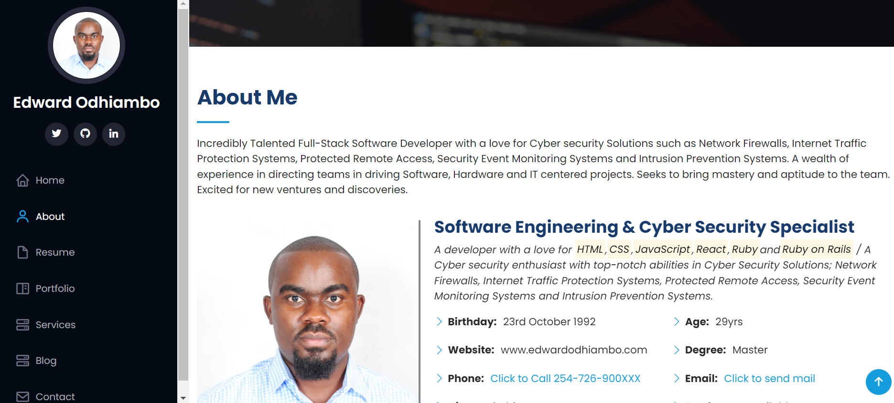
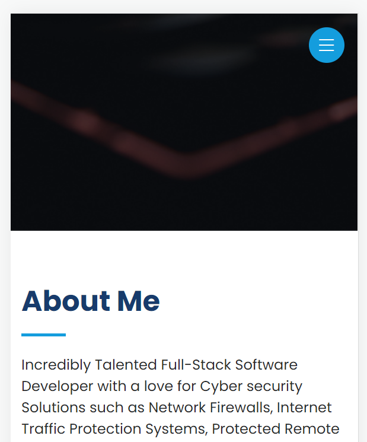

# My-Portfolio
This is my portfolio.

See the project screenshots below:

## Built With

- Major languages - `HTML`, `CSS` and `JavaScript`

## Getting Started

Use this url to clone the repo on your terminal: https://github.com/white3d/My-Portfolio.git

## Authors

👤 **Edward Odhiambo**

[Portfolio Website](https://odhiambo-edward.netlify.app/)

- GitHub: [@whit3d](https://github.com/white3d)
- Twitter: [@odhiambo_ed](https://twitter.com/odhiambo_ed)
- LinkedIn: [Edward Odhiambo](https://www.linkedin.com/in/edward-odhiambo-6a462a21b/)

## 🤝 Contributing

To any developer who would wish to contribute to this project, you are welcome!

## Show your support

Kindly rate ⭐️ this project if you like it.
## Acknowledgments

- Special thanks to Microverse.